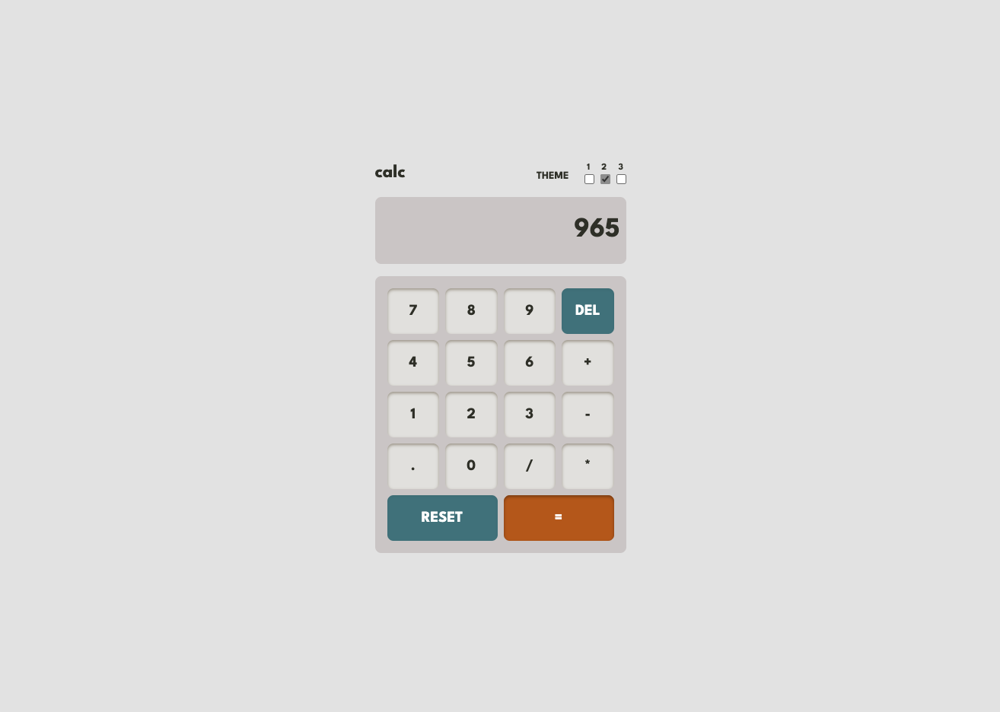
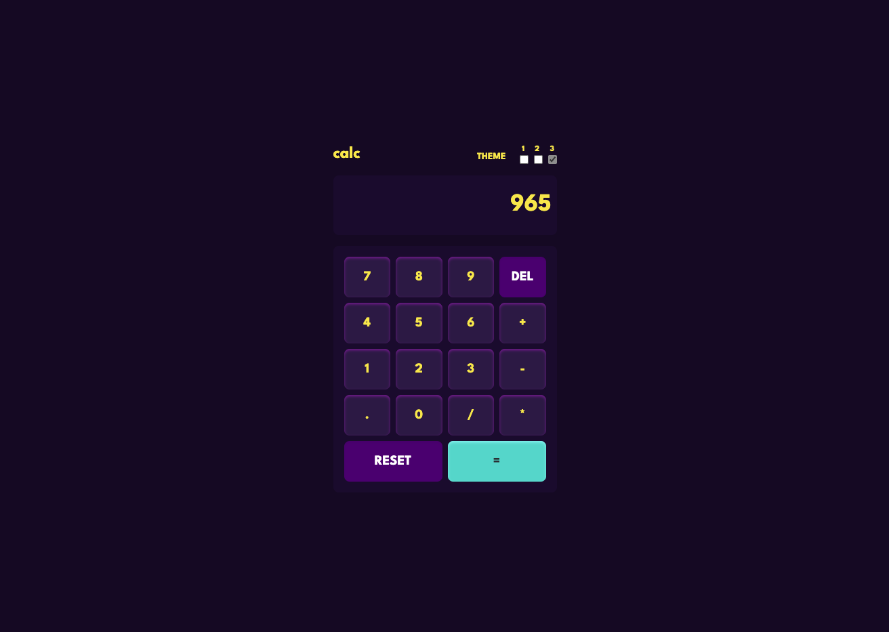
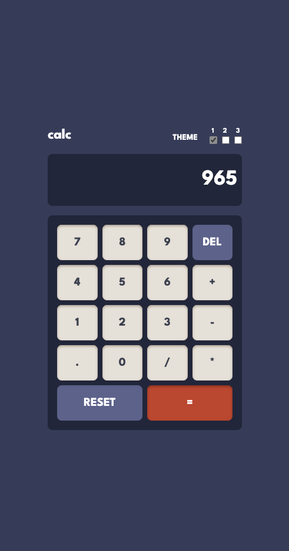
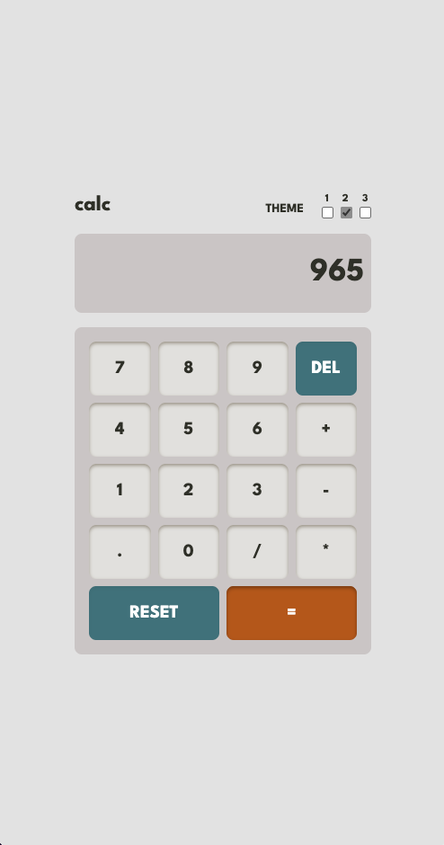
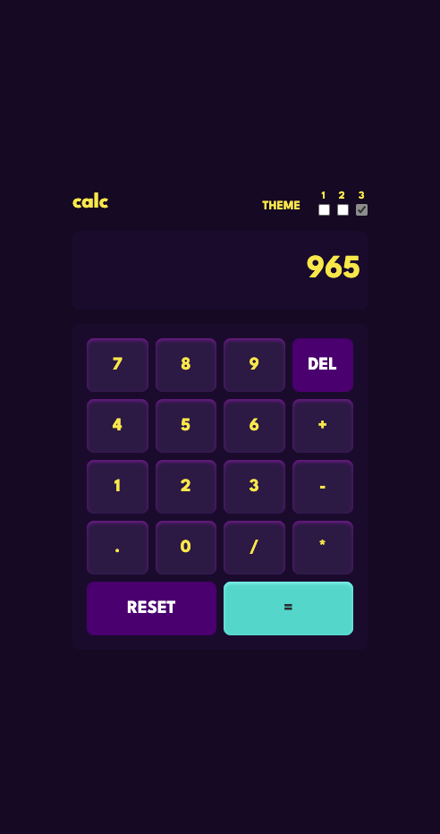

# Frontend Mentor - Calculator app

## Table of contents

- [Frontend Mentor - Calculator App](#)
  - [Table of contents](#table-of-contents)
  - [Overview](#overview)
    - [The challenge](#the-challenge)
    - [Screenshot](#screenshot)
    - [Links](#links)
  - [My process](#my-process)
    - [Built with](#built-with)
    - [What I learned](#what-i-learned)
  - [Author](#author)

## Overview

### The challenge

Users should be able to:

- View the optimal theme depending on the theme selected
- Do calculations using add, subtracting, multiplcation and division.
- Delete a digit if an error occurred.
- Reset the calculator.

### Screenshot

### Links

- Solution URL: [View Github Code](https://github.com/jchapar/calculator_FEM)
- Live Site URL: [Visit Site](https://jchapar.github.io/calculator_FEM)

## My process

### Built with

- Semantic HTML5 markup
- CSS custom properties
- Tailwind CSS
- Flexbox
- Mobile-first workflow
- Figma - For design files
- JavaScript
- ES6 Classes

### What I learned

- TailwindCSS and customizing classes.
- TailwindCSS using general classes that reference the customer css variables.
- Reviewed TailwindCSS documentation to implement multiple themes.
- Practice with the following methods: toString(), parseFloat(), .split()

## Author

- Frontend Mentor - [@jchapar](https://www.frontendmentor.io/profile/jchapar)
- Twitter - [@j_chapar](https://www.twitter.com/j_chapar)
